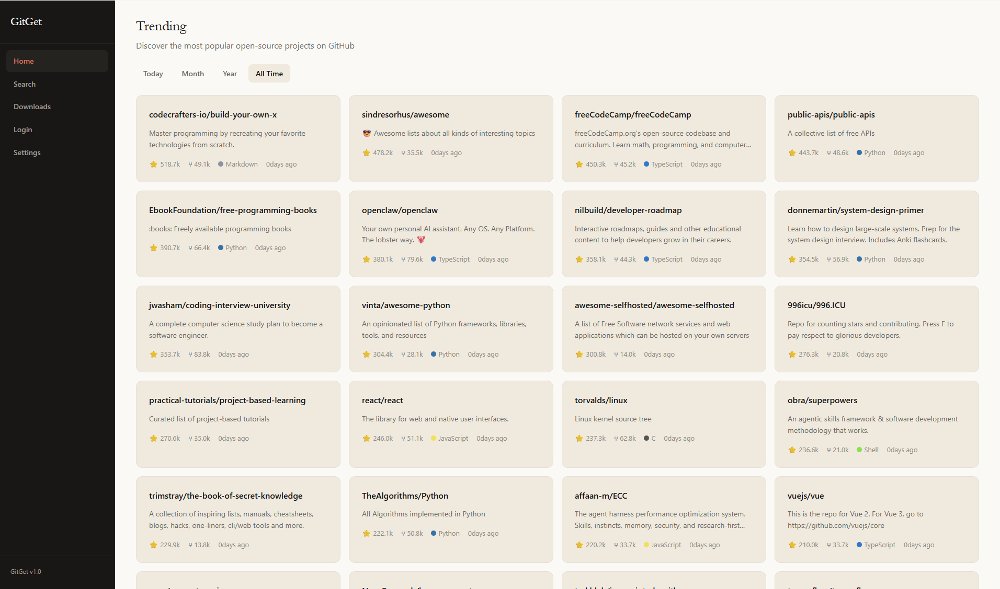

[](https://github.com/illusogl/GitGet)

[](https://dotnet.microsoft.com/)
[](https://dotnet.microsoft.com/apps/aspnet/web-apps/blazor)
[](https://github.com/illusogl/GitGet/actions)
[](LICENSE)
[](../../releases)

```text
  ██████╗ ██╗████████╗ ██████╗ ███████╗████████╗
 ██╔════╝ ██║╚══██╔══╝██╔════╝ ██╔════╝╚══██╔══╝
 ██║  ███╗██║   ██║   ██║  ███╗█████╗     ██║
 ██║   ██║██║   ██║   ██║   ██║██╔══╝     ██║
 ╚██████╔╝██║   ██║   ╚██████╔╝███████╗   ██║
  ╚═════╝ ╚═╝   ╚═╝    ╚═════╝ ╚══════╝   ╚═╝

     GitHub Release 桌面应用商店
```

> **GitGet** 把 GitHub 变成应用商店。无需 Git 命令、无需解压编译，浏览开源项目，一键下载 Release 文件。

---

## 🎯 这是什么

打开 GitGet，你可以：

- 🔥 浏览 GitHub 热门项目（今天 / 本月 / 今年 / 历史排行）
- 🔍 搜索任何开源项目（按星标排序）
- 📖 查看项目 README — 完整的 Markdown 渲染，标题、代码块、表格，和 GitHub 网页版一模一样
- 📥 **一键下载** Release 资源文件（自动推荐最适合你系统的版本）

---

## 📸 截图

<p align="center">
  
</p

---

## /🚀 快速开始

### 下载 v1.0

👉 **[下载 GitGet.WebUI.exe](../../releases/tag/v1.0)**

双击运行。单文件自包含，内置 .NET 运行时，无需安装任何依赖。

> 仅支持 **Windows 10+ x64**。需要 [Edge WebView2 Runtime](https://developer.microsoft.com/microsoft-edge/webview2/)。

### 从源码运行

```bash
# 克隆仓库
git clone https://github.com/illusogl/GitGet.git

# 进入目录
cd GitGet

# 构建并运行
dotnet build
dotnet run --project GitGet.WebUI
```

**需要**：.NET 9.0 SDK · Node.js

---

## 🏗️ 技术栈

| 层 | 技术 |
|---|---|
| 桌面框架 | [Photino.NET](https://github.com/tryphotino/photino.NET) + WebView2 |
| UI | Blazor (Razor Components) |
| 设计 | Warm Cream Editorial Design System |
| API | GitHub REST API v3 |
| 认证 | GitHub OAuth Device Flow / Personal Access Token |
| 桥接 | Node.js HTTPS 代理 |
| Markdown | [Markdig](https://github.com/xoofx/markdig) |
| 缓存 & 存储 | SQLite + Cache-Aside |
| Token 加密 | AES-256-GCM |
| 测试 | xUnit + Moq + FluentAssertions |

---

## 🤝 贡献

我们欢迎任何形式的贡献！无论是 Bug 报告、功能建议还是代码提交。

1. Fork 本仓库
2. 创建你的特性分支 (`git checkout -b feat/amazing-feature`)
3. 提交你的更改 (`git commit -m 'feat: add amazing feature'`)
4. 推送到分支 (`git push origin feat/amazing-feature`)
5. 打开 Pull Request

---

## 📄 许可证

本项目采用 MIT 许可证。详见 [LICENSE](LICENSE)。

---

<p align="center">
  Made with ♥ for the open-source community
</p>